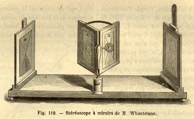
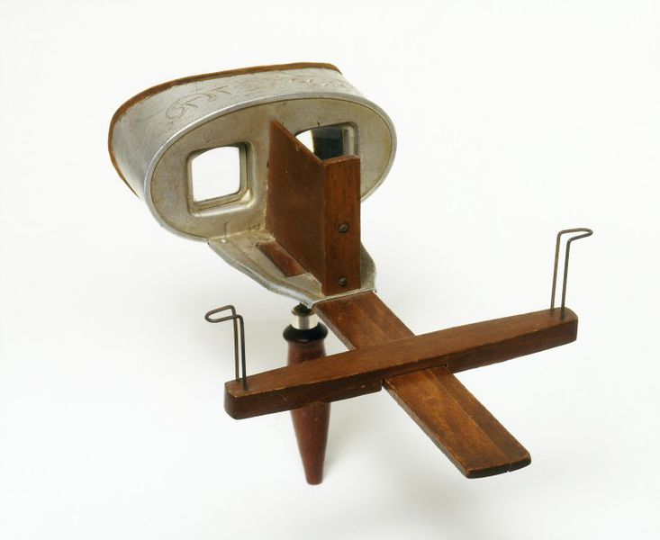
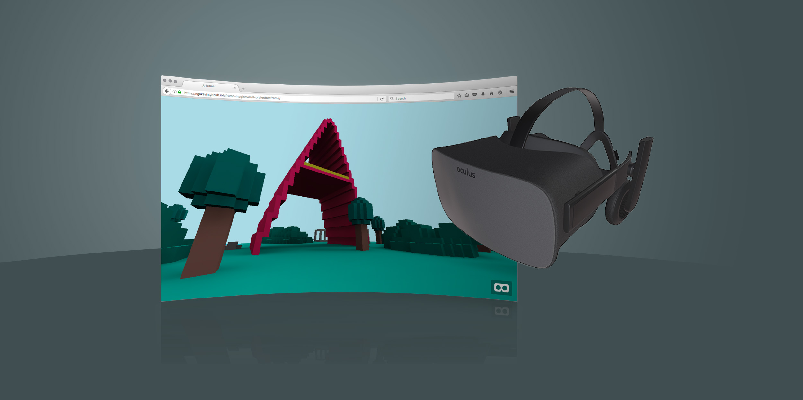
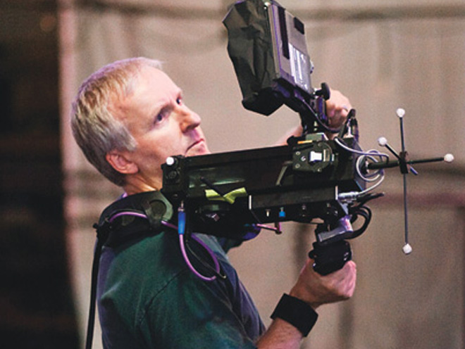

<!-- .slide: data-background="" -->

# Fashion in the 1830s

</img>

------

<!-- .slide: data-background="" -->

# French revolution, 1789

</img>

------

# 1830s Fluffiness

</img>

------

# 1830s Fluffiness

</img>

------

# 1830s Fluffiness

</img>

------

# Stereoscope

</img>

------

# Photography, 1840

</img>

------

# Portable stereoscope

</img>

------

# Google Cardboard, 2014

</img>

------

# High end headset

</img>

------

# WebVR

Browser APIs that enable WebGL rendering to headsets and access to VR
sensors

https://w3c.github.io/webvr/

------

<!-- .slide: data-background="media/img/aframe.jpg" -->

  <h1>A-Frame</h1>
  
A web framework for building VR experiences

  

    @fernandojsg | @ngokevin | @dmarcos | **aframe.io**
  

<!-- NOTES -->
- Onboard web developers into the 3D and VR world with easy-to-use tools
- Prototype WebVR experiences faster

------

<!-- .slide: data-background="media/img/aframe.jpg" -->

# A-Frame

  

    
    <i>6 major releases, 177 contributors, 6000+ Stargazers</i>
  

  

    
    <i>4000+ members on Slack</i>
  

  

    
    <i>100s of featured projects</i>
  

<!-- NOTES -->
- Open source and inclusive project
- Most work done on GitHub
- Active community on Slack to share projects, interact, hang out, seek help
- Featured projects on the `awesome-aframe` repository and *A Week of A-Frame* blog

------

<!-- .slide: data-background="media/img/venn-diagram.gif" -->

<!-- NOTES -->
- A-Frame scene by Ada Rose Edwards running from inside my HTML slides
- Works on desktop, Android, iOS, Samsung Gear VR, Oculus Rift, HTC Vive
- Could open up the DOM Inspector to change values live
- Since it's just HTML...

------

# Entity-Component-System

<!-- .slide: data-background="media/img/minecraft-blocks.png" -->

<!-- NOTES -->
- Is an entity-component framework
- Popular pattern in game development, used by Unity
- All objects in scene are **entities** that inherently empty objects. Plug in
  **components** to attach appearance / behavior / functionality
- 2D web where every element was fixed
- 3D/VR is different, objects of infinite types and complexities, need an easy way to build up different kinds of objects

------

# Registry

<!-- .slide: data-background-color="#333" -->

Curated collection of A-Frame components.

<a class="stretch" href="https://aframe.io/aframe-registry">
  <video loop data-src="media/video/registrypreview.mp4" data-autoplay></video>
</a>

<!-- NOTES -->
- Collecting them into the A-Frame registry
- Like a store of components that we make sure work well
- People can browse and search for components or install them....

------

# Registry

<!-- .slide: data-background-color="#333" -->

Curated collection of A-Frame components.

<video loop data-src="media/video/leaphands.mp4" data-autoplay></video>

------

<!-- .slide: data-background="media/img/header.png" -->

# Community Examples

https://aframe.io/blog/

------

<!-- .slide: data-background="media/img/syria.gif" -->

# Journalism - *Fear of the Sky*

Amnesty International UK

------

<!-- .slide: data-background="media/img/mars.jpg" -->

# Journalism - *Journey to Mars*

The Washington Post

------

<!-- .slide: data-background="media/img/citybuilder.gif" -->

# Sandbox - *City Builder*

@kfarr

------

<!-- .slide: data-background="media/img/adit.gif" -->

# Data Visualization - *Adit*

@datatitian

------

<!-- .slide: data-background="media/img/a-blast.gif" -->

# Gaming - *A-Blast*

@mozillavr

------

<!-- .slide: data-background="media/img/ux.gif" -->

# Prototyping - *UI Widgets*

@whoyee

------

<!-- .slide: data-background="media/img/math.gif" -->

# Mathematics - *MathworldVR*

@sleighdogs

------

<!-- .slide: data-background-color="#222" data-background-video="media/video/ghosttrain.mp4" data-background-video-loop="true" -->

# Entertainment - *Ghost Train*

@realisetweets

------

<!-- .slide: data-background="media/img/apainter.gif" -->

# Art - *A-Painter*

@mozillavr

------

<!-- .slide: data-background="media/img/screenvr.gif" -->

# Utility - *ScreenVR*

@jonathanzwhite

------

<!-- .slide: data-background="media/img/ar.gif" -->

# AR - *aframe-ar.js*

@jerome_etienne

------

<!-- .slide: data-background="media/img/webvrstudio.png" -->

# Tools - *WebVR Studio*

@webvrstudio

------

<!-- .slide: data-background="media/img/shaders.gif" -->

# Shaders - *ShaderFrog*

@machenmusik

------

<!-- .slide: data-background-video="media/video/livetour.mp4" data-background-video-loop="true" -->

# Real Estate - *Live Tour*

iStaging

------

<!-- .slide: data-background="media/img/cadavr.gif" -->

# Education - *CadaVR*

@drryanjames

------

# What's new and what's next?

------

# Link Traversal

</img>

------

# Motion Capture

</img>

------

# Spectator Camera

------

# Vive Tracker Support

</img>

------

# Mixed Reality

<!-- .slide: data-background-video="media/video/virtualreality.mp4" data-background-video-loop="true" data-background-video-muted="true" data-state="state--bg-dark" -->

------

# Tool for motion capture

</img>
